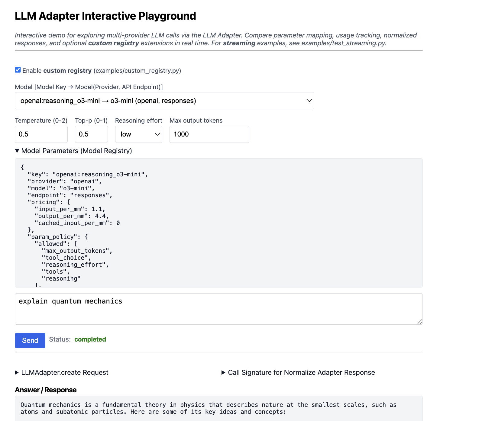

# vrraj-llm-adapter


Registry-driven, extensible LLM routing and response normalization for generation and embeddings (**custom registry** overrides/extensions, explicit endpoint semantics, capability filtering, and parameter mapping).
Install from **PyPI** for the core library, or clone from **GitHub** to run the demo UI and test scripts.


GitHub: [https://github.com/vrraj/llm-adapter](https://github.com/vrraj/llm-adapter) • PyPI: [https://pypi.org/project/vrraj-llm-adapter/](https://pypi.org/project/vrraj-llm-adapter/)

## LLM Adapter Interactive Playground



The Interactive Playground allows for testing models (model registry keys), exposes model registry metadata, parameter controls, answer / response, reasoning tokens (if available), and provider-agnostic normalized responses in one interface.


This package provides:

- **Provider-agnostic** entrypoints for LLM generation and embeddings (call by **registry key**)
- **Custom model registry** support (override/extend the defaults)
- **Normalized response helper**: text, tool calls, reasoning tokens, and usage
- **Registry-based pricing** metadata helpers
- **ModelRegistry**: explicit endpoint routing (**OpenAI**: Responses, Chat Completions, Embeddings • **Gemini**: OpenAI-compatible endpoint, native SDK, embeddings)  model resolution, parameter mapping, and model policies (limits, pricing, reasoning/thinking)
- `ModelSpec`: reusable, typed configuration (structured alternative to kwargs)
- **Streaming** supported at library level

>**Note:** Demo UI and helper scripts are available when running from source.

## Prerequisites

- **Python 3.10+** - Required for union type syntax (`|`) used in the code
  - Tested primarily on Python 3.10–3.12 (3.13 may work but depends on upstream SDK compatibility).
- **pip** - Package installer (use `python3 -m pip` if `pip` not found)
- **LLM API Keys** Currently Supported: OpenAI and Gemini models


## Getting Started


### Option 1: Install from PyPI

1. **Setup virtual environment:**

```bash
# Option A: create a new environment for testing
python3 -m venv .venv
source .venv/bin/activate

# Option B: use your existing application environment
# source your-app-env/bin/activate
```

2. **Install vrraj-llm-adapter:**

```bash
pip install vrraj-llm-adapter
```

The PyPI package includes the core library only. The demo UI and helper scripts are available when running from source (see Option 2 below).

3. **Test it out:**

Set required API keys (see **Environment variables** section below).

Save the following code as `test_llm_adapter.py`, then run:

```bash
python test_llm_adapter.py
```

**Notes:**
- The script below uses **OpenAI registry model keys** (`openai:...`).
- To test Gemini, swap the model keys (from model_registry - `src/llm_adapter/model_registry.py`) to `gemini:native-sdk-3-flash-preview` (generation) and `gemini:native-embed` (embeddings).

```python
from llm_adapter import llm_adapter

# Chat - Registry-key pattern (recommended)
resp = llm_adapter.create(
    model="openai:gpt-4o-mini",  # Registry key - provider inferred
    input=[{"role": "user", "content": "Hello"}],
    max_output_tokens=200,
)
print("Chat Response (includes reasoning tokens):")
print(resp.output_text)
print(f"Usage: {getattr(resp, 'usage', 'Usage info not available')}")

# Embeddings - Registry-key pattern (recommended)
emb_resp = llm_adapter.create_embedding(
    model="openai:embed_small",  # Registry key - provider inferred
    input=["Hello world", "How are you?", "This is a test"]
)
print("Embedding Response:")
for i, emb in enumerate(emb_resp.data):
    print(f"Embedding {i+1} (First 7 vectors): {emb[:7]}...")
print(f"Usage: {getattr(emb_resp, 'usage', 'Usage info not available')}")
```

### Option 2: Run from source (demo UI + editable install)

Do this if you want to run the **demo UI** (runs on port 8100) or make **changes to the code**.

1. Clone the repository and run the setup script.

```bash
git clone https://github.com/vrraj/llm-adapter.git
cd llm-adapter
bash scripts/llm_adapter_setup.sh
```
>This script (scripts/llm_adapter_setup.sh) checks prerequisites (`python3`, `make`), creates `.env` if missing, sets up a local `.venv`, installs the package (`pip install -e .`), and shows **next steps**. The demo UI and FastAPI server run in this `.venv` virtual environment. Safe to run multiple times.

2. Set required API keys (see **Environment variables** section below).

3. Start the application. 

```bash
make start
```
>**Note:** Run `make start` to run in foreground or `make start-bg` to run in background. Use `make stop` to stop the server.

4. Open the demo UI:

- http://localhost:8100/ui/

(See **Run the demo FastAPI server + UI** section below for full details.)

### For Developers: Running Tests

If you want to run the test suite:

```bash
# Install with dev dependencies (includes pytest)
pip install -e ".[dev]"

# Run unit tests only (no API keys required)
pytest tests/unit/

# Run integration tests (requires API keys)
pytest tests/integration/

# Run all tests
pytest
```

**Test Structure:**
- **Unit tests** (`tests/unit/`): Fast tests that validate core functionality without API calls
- **Integration tests** (`tests/integration/): Full API tests that require valid API keys

By default, pytest is configured to skip integration tests unless explicitly requested. Run integration tests with:

```bash
pytest -m integration
```

## Project structure

### Core components

- `src/llm_adapter/`
  - `llm_adapter.py` — standalone adapter implementation (adapted from `chat-with-rag/llm/llm_handler.py`)
  - `ModelSpec.py` — standalone version of `ModelSpec`
  - `model_registry.py` — registry of supported model keys/capabilities/endpoints
  - `__init__.py` — exports `LLMAdapter`, `llm_adapter`, `LLMError`, `ModelSpec`, `model_registry`
- `src/llm_adapter_demo/`
  - `api.py` — FastAPI app exposing `/api/models` and `/api/chat`, plus mounting the UI under `/ui`
  - `config.py` — environment checks + model options (derived from `llm_adapter.model_registry`)
- `ui/`
  - `index.html` — minimal test UI for trying registry model keys
  - `app.js` — frontend wiring to `/api/models` and `/api/chat`
  - `styles.css` — simple styling
- `examples/`
  - `openai_adapter_example.py` — CLI example calling `llm_adapter.create` for OpenAI chat
  - `openai_embedding_example.py` — CLI example calling `llm_adapter.create_embedding` for OpenAI embeddings
  - `streaming_call_example.py` — CLI example calling `llm_adapter.create(stream=True)` and printing deltas as they arrive
  - `setting_openai_base_url.py` — Example showing how to configure custom OpenAI base URL
  - `get_model_pricing_example.py` — Example for retrieving model pricing information
  - `set_adapter_allowed_models.py` — Example for configuring model allowlists
  - `custom_registry.py` — Template for creating custom model registries
  - `import_custom_registry.py` — Example demonstrating custom registry usage
  - `test_model_spec.py` — Comprehensive test script demonstrating ModelSpec usage with different providers and parameter configurations
  - `test_magnitude_metadata.py` — Example showing magnitude metadata for embeddings
  - `test_provider_agnostic_embeddings.py` — Example demonstrating provider auto-detection
- `tests/`
  - `unit/` — Unit tests that don't require API keys
    - `test_imports.py` — Basic package import validation
  - `integration/` — Integration tests that require API keys
    - `test_llm_adapter.py` — Basic chat and embeddings integration tests
    - `test_adapter_embedding_calls.py` — Advanced embedding functionality tests
    - `test_gemini_tool_calls_flow.py` — Gemini tool calling integration tests
    - `test_openai_tool_calls_flow.py` — OpenAI tool calling integration tests


## Architecture and design notes

### Core components

1. **Model Registry** (`src/llm_adapter/model_registry.py`)
   - Central database of model metadata (`ModelInfo`)
   - Endpoint routing hint (e.g. `responses`, `chat_completions`, `embeddings`, `gemini_sdk`, `embed_content`)
   - Capability flags (e.g. `temperature`, `reasoning_effort`, `tools`, `stream`)
   - Parameter mappings (e.g. `max_output_tokens` vs `max_completion_tokens`)

2. **LLM Adapter** (`src/llm_adapter/llm_adapter.py`)
   - Routes generation calls based on registry metadata
   - Routes embedding calls based on registry metadata
   - Applies parameter mapping and capability-based filtering
   - Handles provider routing (OpenAI adapter vs Gemini native SDK)

## Custom model registry (override / extend defaults)

`LLMAdapter` uses the default registry in `src/llm_adapter/model_registry.py`.

You can provide your own registry mapping to `LLMAdapter(model_registry=...)`.
The adapter will merge registries as:

- Default registry (package) + user registry overrides
- User entries replace default entries for the same key

### User-side call signature

```python
from llm_adapter import LLMAdapter
from my_app.my_registry import REGISTRY as USER_REGISTRY

llm = LLMAdapter(model_registry=USER_REGISTRY)
```

### Restricting which models can be used (allowlist)

You can restrict which registry keys may be used by setting an allowlist. When an allowlist is enabled, models must be referenced by **registry key** (for example: `openai:gpt-4o-mini`). Provider-native model names (for example: `gpt-4o-mini`) are rejected.

#### Option A: via constructor (`allowed_model_keys`)

```python
from llm_adapter import LLMAdapter

llm = LLMAdapter(
    allowed_model_keys={"openai:gpt-4o-mini", "openai:embed_small"}
)
```

#### Option B: via environment variable (`LLM_ADAPTER_ALLOWED_MODELS`)

```bash
export LLM_ADAPTER_ALLOWED_MODELS="openai:gpt-4o-mini,openai:embed_small"
```

### Validating registries

If you provide your own registry, you can validate it before instantiating the adapter.

```python
from llm_adapter.model_registry import validate_registry
from my_app.my_registry import REGISTRY as USER_REGISTRY

validate_registry(USER_REGISTRY, strict=False)
```

You can also validate the merged registry (defaults + your overrides) after creating the adapter:

```python
from llm_adapter import LLMAdapter
from llm_adapter.model_registry import validate_registry
from my_app.my_registry import REGISTRY as USER_REGISTRY

llm = LLMAdapter(model_registry=USER_REGISTRY)
validate_registry(llm.model_registry, strict=False)
```

## Merging Custom Registries (Interactive Demo)

The LLM Adapter includes an **interactive demo UI** that allows you to test custom registries without writing any code. This is perfect for experimenting with new model configurations before integrating them into your application.

### Quick Start with Demo UI

1. **Start the demo server:**
   ```bash
   cd llm-adapter
   source .venv/bin/activate  # or activate your venv
   uvicorn llm_adapter_demo.api:app --reload --host 0.0.0.0 --port 8100
   ```

2. **Open the UI:** Navigate to `http://localhost:8100/ui`

3. **Enable custom registry:** Check the "Merge custom registry (examples/custom_registry.py)" checkbox

4. **Select your custom models:** The dropdown will now show both default and custom models

### How the Demo Works

The demo UI dynamically loads your custom registry from `examples/custom_registry.py` and merges it with the default registry. When you toggle the checkbox:

- **Unchecked:** Shows only default models from `src/llm_adapter/model_registry.py`
- **Checked:** Shows merged registry (default + your custom models)

### Creating Your Custom Registry

**File:** `examples/custom_registry.py`

```python
from llm_adapter.model_registry import ModelInfo, Pricing, validate_registry

REGISTRY = {
    "openai:custom_reasoning_o3-mini": ModelInfo(
        key="openai:custom_reasoning_o3-mini",  # Must match dict key
        provider="openai",
        model="o3-mini",
        endpoint="responses",
        pricing=Pricing(input_per_mm=1.10, output_per_mm=4.40),
        limits={"max_output_tokens": 2000},
        capabilities={
            "assistant_role": "assistant",
            "reasoning_effort": True,
        },
        param_policy={"disabled": {"stream", "temperature", "top_p"}},
        reasoning_policy={
            "mode": "openai_effort",
            "default": "low",
        },
        reasoning_parameter=("reasoning_effort", "low"),
    ),
    "openai:custom_reasoning_gpt-5-mini": ModelInfo(
        key="openai:custom_reasoning_gpt-5-mini",  # Must match dict key
        provider="openai",
        model="gpt-5-mini",
        endpoint="responses",
        pricing=Pricing(input_per_mm=0.25, output_per_mm=2.00),
        limits={"max_output_tokens": 2000},
        capabilities={
            "assistant_role": "assistant",
            "reasoning_effort": True,
        },
        param_policy={"disabled": {"stream", "temperature", "top_p"}},
        reasoning_policy={
            "mode": "openai_effort",
            "default": "minimal",
        },
        reasoning_parameter=("reasoning_effort", "minimal"),
    ),
}

# Validate your registry (recommended)
validate_registry(REGISTRY, strict=False)
```

### Testing Your Custom Registry

**Script:** `examples/import_custom_registry.py`

Run this test script to verify your custom registry works correctly:

```bash
cd llm-adapter
source .venv/bin/activate
python examples/import_custom_registry.py
```

This script validates:
- ✅ Custom registry import and merging
- ✅ Model availability (custom + default)
- ✅ Pricing lookup for custom models
- ✅ Registry validation
- ✅ Model resolution functionality

### Live Updates

**No reinstall required!** When you modify `examples/custom_registry.py`:

1. Save your changes
2. Toggle the checkbox in the UI (or make a new API call)
3. Your changes are immediately available

The custom registry is **dynamically imported** on each request, so you can iterate quickly on model configurations.

### Integration Examples

See these files for complete working examples:

- **`examples/custom_registry.py`** - Sample custom registry with reasoning models
- **`examples/import_custom_registry.py`** - Test script demonstrating programmatic usage
- **`src/llm_adapter_demo/api.py`** - Backend implementation showing dynamic registry loading

### Production Usage

For production use, you can:

1. **Move your registry** to your application package
2. **Use the same pattern** as the demo: `LLMAdapter(model_registry=YOUR_REGISTRY)`
3. **Validate before deployment** using `validate_registry()`

The demo UI provides a sandbox for testing before integrating into your production code.

## Custom Registry Override

For quick registry overrides without the demo UI:

1. **Copy the template from examples/custom_registry.py**
   ```bash
   # Start with the provided template
   cp examples/custom_registry.py my_app/my_registry.py
   ```

2. **Modify only what you need (or add new models)**
   ```python
   # Option A: Override existing model from template
   "openai:custom_reasoning_o3-mini": ModelInfo(
       # Keep most template defaults, change only what you need
       pricing=Pricing(input_per_mm=0.8, output_per_mm=3.2),  # Custom pricing
       limits={"max_output_tokens": 3000},  # Custom limits
   )
   
   # Option B: Add entirely new model
   "openai:custom-gpt4-turbo": ModelInfo(
       key="openai:custom-gpt4-turbo",
       provider="openai", 
       model="gpt-4-turbo",
       endpoint="chat_completions",
       pricing=Pricing(input_per_mm=0.3, output_per_mm=0.9),
       limits={"max_output_tokens": 4096},
       capabilities={"assistant_role": "assistant"},
   )
   ```

3. **Instantiate LLMAdapter with your registry**
   ```python
   from llm_adapter import LLMAdapter
   from my_app.my_registry import REGISTRY as YOUR_REGISTRY
   
   llm = LLMAdapter(model_registry=YOUR_REGISTRY)
   ```

4. **(Optional) Use allowed_model_keys for strict environments**
   ```python
   # Restrict to only specific models
   llm = LLMAdapter(
       model_registry=YOUR_REGISTRY,
       allowed_model_keys={"openai:gpt-4o-mini", "openai:embed_small"}
   )
   ```

This approach gives you full control over model configurations while maintaining the same API interface.

### Registry Override Behavior

**Custom registries override default registry keys with the same key:**

- **Same key**: Custom model replaces default model
- **Different key**: Custom model is added to defaults
- **Merged result**: Your custom registry + remaining defaults

```python
# Example: Override default gpt-4o-mini with custom pricing
"openai:gpt-4o-mini": ModelInfo(
    key="openai:gpt-4o-mini",  # Same key as default registry
    provider="openai",
    model="gpt-4o-mini",
    endpoint="chat_completions",
    pricing=Pricing(input_per_mm=0.2, output_per_mm=0.6),  # Custom pricing overrides default
    # ... other fields
)
```

**Result**: When you use `LLMAdapter(model_registry=YOUR_REGISTRY)`, the custom `openai:gpt-4o-mini` completely replaces the default one.

### Endpoint semantics (important)

This standalone package uses these routing semantics:

- `endpoint="responses"`
  - Uses OpenAI **Responses API** (`client.responses.create(...)`).
- `endpoint="chat_completions"`
  - Uses OpenAI **Chat Completions API** (`client.chat.completions.create(...)`).
- `endpoint="embeddings"`
  - Uses OpenAI **embeddings create** (`client.embeddings.create(...)`).
- `endpoint="gemini_sdk"`
  - Uses Gemini native **SDK** (`google-genai` `models.generate_content(...)` / `generate_content_stream(...)`).
- `endpoint="embed_content"`
  - Uses Gemini **embed_content** (`google-genai` `models.embed_content(...)`).


## Call Signature

`LLMAdapter.create(...)` accepts a small set of explicit parameters (`input`, `provider`, `model`, `spec`, `stream`) plus **arbitrary keyword arguments** (`**kwargs`). The adapter then uses the model registry to map/filter some of those kwargs before calling the underlying provider SDK.

### How kwargs are processed (high level)

1. **Spec merge (optional)**
   - If `spec=ModelSpec(...)` is provided, merge `spec.to_kwargs()` with explicit `kwargs` (explicit wins).

2. **Drop `None` values**
   - Remove `kwargs` entries where the value is `None`.

3. **Token limit mapping (registry-driven)**
   - Remap token-limit params to the model’s configured name via `ModelInfo.max_tokens_parameter`
     (e.g. `max_output_tokens` → `max_completion_tokens`).

4. **Capability filtering (registry-driven)**
   - Drop known parameters that are explicitly unsupported for that model (e.g. `temperature`, `top_p`, `reasoning_effort`, `stream`, `tools`).
   - Unknown kwargs are generally passed through and may be accepted/rejected by the downstream SDK.

## Capability Filtering System

The adapter uses a **registry-driven capability filtering system** to ensure parameters are handled appropriately for each model. This provides model-agnostic behavior while respecting model-specific constraints.

### How Capability Filtering Works

For each model in the registry, capabilities are defined with three types of values:

1. **`False`** - Parameter is **unsupported** and **removed** from kwargs (even if user passes it)
2. **`True`** - Parameter is **supported** and **passed through** to the underlying LLM
3. **Non-boolean values** - Parameter has a **default value** that can be overridden by user

### Example: Model Registry Capabilities

```python
# In src/llm_adapter/model_registry.py
"gemini:native-embed": ModelInfo(
    key="gemini:native-embed",
    provider="gemini",
    model="gemini-embedding-001",
    endpoint="embed_content",
    capabilities={
        "dimensions": 1536,                    # Default value
        "task_type": "RETRIEVAL_DOCUMENT",      # Default value  
        "output_dimensionality": 1536,           # Default value
        "normalize_embedding": False,              # Unsupported - always dropped
    },
),
```

### Filtering Logic Examples

#### Example 1: Parameter with `False` capability

```python
# User passes normalize_embedding=True
llm_adapter.create_embedding(
    model="gemini:native-embed",
    input=["test"],
    normalize_embedding=True  # User wants this
)

# Result: normalize_embedding is DROPPED (capability=False)
# Adapter handles normalization internally instead of passing to LLM
```

#### Example 2: Parameter with default value capability

```python
# User passes custom task_type
llm_adapter.create_embedding(
    model="gemini:native-embed", 
    input=["test"],
    task_type="RETRIEVAL_QUERY"  # Override default "RETRIEVAL_DOCUMENT"
)

# Result: task_type="RETRIEVAL_QUERY" passed to LLM
```

#### Example 3: Unknown parameter (not in capabilities)

```python
# User passes unknown parameter
llm_adapter.create_embedding(
    model="gemini:native-embed",
    input=["test"], 
    unknown_param="value"  # Not in capabilities
)

# Result: unknown_param="value" passed through to LLM
# May be accepted or rejected by downstream SDK
```

### Special Case: Adapter-Level Parameters

Some parameters (like `normalize_embedding`) are handled by the **adapter layer**, not the underlying LLM:

```python
# Extract adapter-level parameters BEFORE capability filtering
normalize_embedding = bool(kwargs.pop("normalize_embedding", False))

# Then apply capability filtering to remaining kwargs
# normalize_embedding is handled by adapter, never passed to LLM
```

### Forcing a False Capability

If a user specifically needs to pass a parameter that's marked as `False` in capabilities:

```python
# This WON'T work - parameter gets dropped
llm_adapter.create_embedding(
    model="gemini:native-embed",
    input=["test"],
    normalize_embedding=False  # Still gets dropped due to capability=False
)

# Solution: Pass through unknown kwargs
llm_adapter.create_embedding(
    model="gemini:native-embed", 
    input=["test"],
    custom_normalize_embedding=False  # Unknown parameter, passes through
)
```

### Benefits

- **Model safety**: Prevents unsupported parameters from reaching LLMs
- **Consistent behavior**: Same parameter works across different models when supported
- **Graceful degradation**: Unknown parameters pass through for future compatibility
- **Adapter-level features**: Parameters like `normalize_embedding` work regardless of LLM support

5. **Reasoning effort mapping/defaults (registry-driven)**
   - Map `reasoning_effort` into provider-specific parameters using `ModelInfo.reasoning_parameter` (Gemini examples: `thinking_level`, `thinking_budget`).
   - Apply defaults when the model is reasoning-capable and no effort is provided.

6. **Gemini thinking tax / config injection (Gemini-only)**
   - For Gemini models with `thinking_tax`, adjust token budgets and/or inject thinking config via `extra_body`.

### Common parameters you can pass today

These are the parameters the demo UI and handler paths are designed around:

- `temperature`: `float`
- `top_p`: `float`
- `max_output_tokens`: `int`
- `reasoning_effort`: `str` (e.g. `none`, `minimal`, `low`, `medium`, `high`)
- `tools`: list of OpenAI-style tool/function declarations
- `stream`: `bool`

In addition, the handler passes through many provider-specific kwargs. Two common escape hatches are:

- `extra_body`: `dict`
  - For OpenAI-compatible calls this can be used to pass provider-specific JSON fields.
- `timeout`: number/seconds (only effective on some SDK paths).

### Passing additional parameters safely

- Prefer **registry-known parameters** (those already used by existing call sites) for portability.
- If you pass a provider SDK parameter that the downstream method does not accept, you may get a `TypeError` (unexpected keyword argument) from the SDK.
- If you want the handler to reliably drop/accept a parameter for a given model key, add it to that model’s `capabilities` in `src/llm_adapter/model_registry.py`.

## Embeddings API (registry-routed)

`llm_adapter.create_embedding(...)` is provider-agnostic:

```python
resp = llm_adapter.create_embedding(
    model="...",  # registry key (provider auto-detected)
    input="...",  # str or list[str]
    **kwargs,
)
```

## ModelSpec: Structured Configuration

`ModelSpec` provides a type-safe, reusable way to configure model parameters as an alternative to passing individual parameters.

>**Note**: See `examples/test_model_spec.py` for a test script demonstrating ModelSpec usage with different providers and parameter configurations.

### Using ModelSpec

```python
from llm_adapter import llm_adapter
from llm_adapter import ModelSpec

# Create a reusable configuration
# Note: ModelSpec requires explicit provider and uses provider-native model names
chat_spec = ModelSpec(
    provider="openai",                    # Required: explicit provider
    model="gpt-4o-mini",                # Provider-native model name
    temperature=0.7,
    max_output_tokens=1000,
    extra={"custom_param": "value"}       # General provider-specific parameters
)

# Alternative with extra_body for OpenAI-compatible providers
chat_spec_with_body = ModelSpec(
    provider="openai",
    model="gpt-4o-mini",
    temperature=0.7,
    extra={"extra_body": {"custom_field": "value"}}  # For provider-specific JSON fields
)

# Use the spec in multiple calls
resp1 = llm_adapter.create(spec=chat_spec, input=[{"role": "user", "content": "Hello"}])
resp2 = llm_adapter.create(spec=chat_spec, input=[{"role": "user", "content": "How are you?"}])

# Works with embeddings too
embed_spec = ModelSpec(
    provider="openai",                    # Required: explicit provider
    model="text-embedding-3-small"       # Provider-native model name
)
resp = llm_adapter.create_embedding(spec=embed_spec, input="Text to embed")
```

### ModelSpec vs Individual Parameters

| Approach | Provider | Model Name | Auto-detection | Type Safety |
|----------|----------|------------|----------------|-------------|
| **Individual params** | Optional (auto-detected from registry) | Registry key (`openai:gpt-4o-mini`) | ✅ Yes | ❌ Runtime |
| **ModelSpec** | Required (explicit) | Provider-native (`gpt-4o-mini`) | ❌ No | ✅ Static type-checkers |

### Benefits

- **Type Safety**: Provider type hints support static checking (e.g. mypy/pyright)
- **Configuration Reuse**: Define once, use multiple times
- **Stable call sites**: Keep call sites consistent even when provider parameters differ (registry maps where needed)
- **Clean API**: Organized parameter grouping
- **Flexibility**: Mix spec with additional kwargs

## API usage and normalization

### Non-streaming usage (common case)

```python
from llm_adapter import llm_adapter

resp = llm_adapter.create(
    provider="openai",
    model="openai:gpt-4o-mini",
    input=[{"role": "user", "content": "Hello"}],
    stream=False,
    max_output_tokens=200,
)

print(f"Response: {resp}")
print(f"Output text: {resp.output_text}")
print(f"Usage: {resp.usage}")
```

>`llm_adapter.create(...)` returns the provider-native response object. Use `llm_adapter.normalize_adapter_response(...)` for a provider-agnostic normalized view (see API Reference below).


### Streaming

When `stream=True`, `llm_adapter.create(...)` returns an **iterator**, not a normal JSON-serializable response.

- If you call `LLMAdapter.create(stream=True)` in Python code, you must iterate the returned events.
- The included demo FastAPI `/api/chat` endpoint is designed for **non-streaming JSON** responses. Streaming is supported in Python via `create(stream=True)`; the demo UI uses non-streaming for simplicity.


>Use the CLI script `examples/test_streaming.py` to test streaming at the library level.

**Usage Example:** `python examples/test_streaming.py --provider openai --model openai:gpt-4o-mini --prompt "explain quantum physics in less than 50 words"`

## Response Structure

For detailed information about the `AdapterResponse` format, serialization behavior, and field naming conventions, see **[AdapterResponse.md](AdapterResponse.md)**.

## API Reference

Below are the primary public APIs exposed by `llm_adapter`.

### `llm_adapter.create(...)`

Unified generation entrypoint across providers.

```python
resp = llm_adapter.create(
    input: str | list[dict],
    provider: Optional[str] = None,
    model: Optional[str] = None,
    spec: Optional[ModelSpec] = None,
    stream: bool = False,
    **kwargs
)
```

- Resolves provider automatically from registry key if not passed.
- Routes to the appropriate endpoint (`responses`, `chat_completions`, `gemini_sdk`, etc.).
- Applies registry-driven parameter mapping and capability filtering.
- Returns a provider-native response (or an iterator when `stream=True`).

---

### `llm_adapter.create_embedding(...)`

Unified embeddings entrypoint across providers.

```python
emb = llm_adapter.create_embedding(
    model: str,  # Registry key (e.g., "openai:embed_small") or provider-native model name
    input: str | list[str],
    **kwargs
)
```
**Note:**: For Gemini native embeddings, requesting a lower `output_dimensionality` (e.g. 768 for a 1536 embedding model), passing `normalize_embedding=True` will normalize vectors to unit length.

Returns `EmbeddingResponse` with normalized structure across providers:
  - `data`: List of embedding vectors (each vector is List)
  - `usage`: Usage information (prompt_tokens, total_tokens)
  - `provider`: Provider identifier (e.g., "openai", "gemini")
  - `model`: Model name used
  - `normalized`: True if vectors were normalized to unit length
  - `vector_dim`: Output dimension vectors
  - `metadata`: Dictionary with additional metadata (magnitudes, task_type, etc.)
  - `raw`: Original provider response for debugging

---

### `llm_adapter.normalize_adapter_response(...)`

Provider-agnostic normalization helper.

```python
result = llm_adapter.normalize_adapter_response(
    resp,
    provider: Optional[str] = None,
    model_key: Optional[str] = None
)
```

- Normalizes text, usage, reasoning tokens, and tool calls.
- If `provider` is not provided, attempts inference from:
  1. `model_key`
  2. `resp.model`
  3. defaults to `"openai"`
- Returns a consistent dictionary structure across providers.

#### Example 1: Let the adapter infer provider from registry key

```python
resp = llm_adapter.create(
    model="gemini:openai-reasoning-2.5-flash",
    input=[{"role": "user", "content": "Explain gravity briefly"}],
)

result = llm_adapter.normalize_adapter_response(
    resp,
    model_key="gemini:openai-reasoning-2.5-flash"
)

print(result["text"])
print(result["usage"])
```

#### Example 2: Provider-native pattern (explicit provider)

```python
resp = llm_adapter.create(
    provider="openai",           # Explicit provider
    model="gpt-4o-mini",         # Provider-native model name
    input=[{"role": "user", "content": "Hello"}],
)

result = llm_adapter.normalize_adapter_response(
    resp,
    provider="openai"
)
print(result["text"])
print(result["tool_calls"])
```

---

#### Example 3: Fully automatic inference (from `resp.model` when available)

```python
resp = llm_adapter.create(
    model="openai:gpt-4o-mini",
    input="Hello",
)

result = llm_adapter.normalize_adapter_response(resp)

print(result["provider"])
print(result["text"])
```

---

### `llm_adapter.get_pricing_for_model(...)`

Lookup pricing metadata via the model registry.

This accepts either:

- a registry model key (e.g. `openai:gpt-4o-mini`), or
- a provider-native model name (e.g. `gpt-4o-mini-2024-07-18`) when resolvable.

```python
pricing = llm_adapter.get_pricing_for_model("openai:gpt-4o-mini")
pricing2 = llm_adapter.get_pricing_for_model("gpt-4o-mini-2024-07-18")
```

- Returns pricing metadata stored in the model registry (if defined).
- Does not compute costs — exposes registry metadata only.

## Internal Architecture

### Model Registry Design

The model registry uses registry keys as unique identifiers (e.g., `"openai:gpt-4o-mini"`) with comprehensive metadata including pricing, capabilities, parameter restrictions, and provider-specific configurations.

### API Response Format

The demo UI converts internal `ModelInfo` objects to JSON-compatible responses for browser consumption, including runtime status like provider availability.

### Key Principles

- **Registry keys** serve as the sole model identifier (no redundant `ModelInfo.key` field)
- **Provider inference** from key format (`"provider:model"`)
- **JSON serialization** ensures browser compatibility
- **Runtime validation** maintains registry integrity

## Unified Token Accounting

LLMAdapter returns a consistent usage schema across all providers:

### Usage Schema
```json
{
  "prompt_tokens": int,     # non-cached prompt
  "cached_tokens": int,     # cached prompt (separate rate)
  "output_tokens": int,     # billed output (answer + reasoning)
  "reasoning_tokens": int,  # hidden/thought tokens
  "answer_tokens": int,     # visible output
  "total_tokens": int       # total billed tokens
}
```

### Billing Calculation
```python
pricing = llm_adapter.get_pricing_for_model("openai:gpt-4o-mini")
usage = response.usage

input_cost = (
    usage["prompt_tokens"] * pricing["input_per_mm"] / 1_000_000 +
    usage["cached_tokens"] * pricing["cached_input_per_mm"] / 1_000_000
)

output_cost = usage["output_tokens"] * pricing["output_per_mm"] / 1_000_000

total_cost = input_cost + output_cost
```

**Key relationships:**
- `output_tokens = answer_tokens + reasoning_tokens`
- `total_tokens = prompt_tokens + cached_tokens + output_tokens`

## Environment variables

Copy `.env.example` to `.env` and to set up your API keys (or use your existing environment variables):

```bash
cp .env.example .env
```

Supported env vars:

**Minimal working sets:**
- **OpenAI-only**: `OPENAI_API_KEY`
- **Gemini native SDK**: `GEMINI_API_KEY`
- **Gemini OpenAI-compatible**: `GEMINI_API_KEY` + `GEMINI_OPENAI_BASE_URL`

**All supported variables:**
- `OPENAI_API_KEY`
- `OPENAI_BASE_URL` (optional) — override the OpenAI-compatible endpoint (proxy / gateway / self-hosted / Azure-like setups). If unset, the OpenAI SDK default is used.
- `GEMINI_API_KEY`
- `GEMINI_OPENAI_BASE_URL`
- `LLM_ADAPTER_ALLOWED_MODELS` (comma-separated list of allowed model keys)


## Run the demo FastAPI server + UI

You can start the **LLM Adapter Interactive Playground** directly with `uvicorn` or via the `Makefile`.

### Option A: direct uvicorn

```bash
uvicorn llm_adapter_demo.api:app --reload --port 8100
```

* API root: http://127.0.0.1:8100/
* **LLM Adapter Interactive Playground**: http://127.0.0.1:8100/ui/

### Option B: Makefile helpers

From the repo root:

```bash
# Create venv and install package (if not already done)
make install

# Run in foreground (logs to console)
make start

# Run in background (logs to logs/llm_adapter_demo.log)
make start-bg

# Stop / kill background server and free the port
make stop   # SIGTERM
make kill   # SIGKILL

# Tail background logs
make logs
```

The **LLM Adapter Interactive Playground** will:

- Call `/api/models` to list available registry model keys (and whether each provider is enabled based on env vars).
- Call `/api/chat` to send prompts to the selected model key via `llm_adapter.create(...)`.

The **LLM Adapter Interactive Playground**/API supports additional inference parameters:

- `temperature`
- `top_p`
- `reasoning_effort`
- `max_output_tokens`

When `reasoning_effort` is set for a reasoning-capable Gemini model, the handler requests thoughts via `include_thoughts` and the **LLM Adapter Interactive Playground** displays both **Reasoning** and **Answer** separately.

### ModelInfo API Response

The demo API (`src/llm_adapter_demo/config.py`) serializes `ModelInfo` objects for UI consumption:

- **Registry key** is added from the dictionary key (no redundant `ModelInfo.key` field)
- **Pricing objects** are converted to JSON-compatible dictionaries
- **Runtime status** (`enabled`) is added based on environment variable availability
- **All fields** are converted to JSON-serializable formats for browser compatibility

This ensures the **LLM Adapter Interactive Playground** can display complete model information including pricing, capabilities, parameter restrictions, and real-time provider availability.


## Examples

The `examples/` folder contains practical scripts that demonstrate how to use the llm-adapter library. These examples are designed to be learning resources and starting points for your own applications.

**Prerequisite**: Install the package (via PyPI or `pip install -e .` if running from source).

### Basic Usage Examples

#### OpenAI Chat Example
```bash
python examples/openai_adapter_example.py "Say hello from llm-adapter"
```

Demonstrates basic chat completion using the registry key pattern.

#### OpenAI Embeddings Example
```bash
python examples/openai_embedding_example.py "Embed this text via llm-adapter"
```

Shows how to generate embeddings using registry keys.

#### Streaming Example
```bash
# OpenAI streaming
export OPENAI_API_KEY="..."
python examples/streaming_call_example.py --model-key openai:gpt-4o-mini --prompt "seattle attractions" --max-output-tokens 200

# Gemini streaming
export GEMINI_API_KEY="..."
python examples/streaming_call_example.py --model-key gemini:native-sdk-3-flash-preview --prompt "seattle attractions" --max-output-tokens 200
```

Demonstrates real-time streaming responses.

### Configuration Examples

#### Custom Base URL
```bash
python examples/setting_openai_base_url.py
```

Shows how to configure custom OpenAI endpoints (useful for proxies, gateways, or self-hosted setups).

#### Model Pricing Lookup
```bash
# Get pricing for a specific model
python examples/get_model_pricing_example.py openai:gpt-4o-mini

# List all available models
python examples/get_model_pricing_example.py
```

Demonstrates how to access pricing metadata from the model registry.

#### Model Allowlist Configuration
```bash
python examples/set_adapter_allowed_models.py
```

Shows how to restrict which models can be used for security and control.

### Advanced Examples

#### Custom Registry
```bash
# Test custom registry integration
python examples/import_custom_registry.py
```

Demonstrates how to create and use custom model registries.

#### ModelSpec Configuration
```bash
python examples/test_model_spec.py
```

Comprehensive example showing ModelSpec usage with different providers and parameter configurations.

#### Magnitude Metadata
```bash
python examples/test_magnitude_metadata.py
```

Shows how to work with embedding magnitude metadata and normalization.

#### Provider-Agnostic Embeddings
```bash
python examples/test_provider_agnostic_embeddings.py
```

Demonstrates automatic provider detection from registry keys.

### Key Features Demonstrated

- **Registry-driven model selection** - Use keys like `"openai:gpt-4o-mini"` instead of provider-specific configs
- **Provider auto-detection** - The adapter automatically determines the provider from registry keys
- **Capability filtering** - Parameters are automatically filtered based on model capabilities
- **Streaming support** - Real-time response streaming for compatible models
- **Custom configurations** - Base URLs, registries, and model allowlists
- **Pricing metadata** - Access to cost information for different models
- **Type safety** - ModelSpec provides structured, reusable configurations

## Supported Providers

Supports:
- **OpenAI** (Responses API, Chat Completions API, Embeddings API)
- **Gemini** (native `google-genai` SDK and OpenAI-compatible endpoint)

Models and capabilities are defined in `src/llm_adapter/model_registry.py`.

## Adding New Models

To add support for a new model:

1. Open `src/llm_adapter/model_registry.py`
2. Add a new entry to the `MODEL_INFO` dictionary
3. Define its endpoint (e.g., `chat_completions` or `gemini_sdk`) and its capabilities
4. Test it via the Demo UI

## Development

This is a standalone package. Development happens directly in this repo. To install and test changes locally:

```bash
pip install -e .
make start
```


## License

This project is licensed under the MIT License. See the `LICENSE` file for details.
